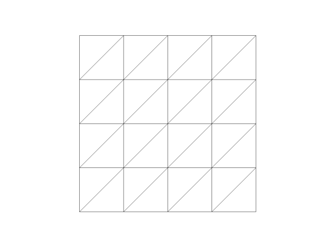

# 다음 격자 꼭지점마다 말을 놓으려 한다.
## nxn격자가 주어지면 n+1개 말을 놓는다.
## 같은 줄, 같은 칸에는 말이 2개 있어서는 안된다.
## 대각선으로 연결된 모든 위치에도 말이 2개 있어서는 안된다.
## 격자가 주어지면 말을 놓을 수 있는 최대 수를 구하여라.

 

# 주어지는 격자는 다음과 같다.
## 0 -> 왼쪽 위에서 오른쪽 아래
## 1 -> 오른쪽 위에서 왼쪽 아래
## 2 -> 대각선 없음.
## data 예시:
## input
[[1,1,2,0],[1,0,0,2],[1,2,2,2],[2,2,0,0]]

